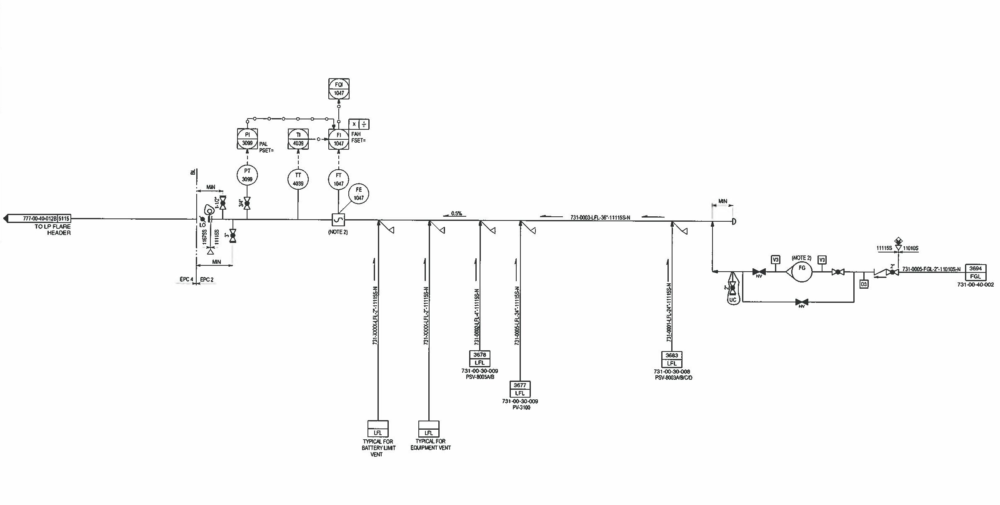

# P&ID Diagram Processing System

This project provides tools for processing Piping and Instrumentation Diagrams (P&IDs) to detect symbols and remove pipes. It implements two different approaches for P&ID processing:

1. Deep Learning-based (YOLO) approach for symbol detection followed by pipe removal
2. Traditional Computer Vision approach using morphological operations

## Approaches

### 1. YOLO-based Approach

The YOLO-based approach uses a YOLOv11 model trained specifically for detecting symbols in P&ID diagrams. The process works as follows:

1. Load a trained YOLOv11 model to detect symbols in the input diagram
2. Create a binary mask from the detected symbol bounding boxes
3. Use the mask to identify and remove pipes while preserving symbols
4. The pipe removal uses a combination of:
   - Hough Line Transform for straight pipes
   - Adaptive thresholding for curved pipes
   - Various morphological operations for cleaning

This approach works best when you have a well-trained model for your specific P&ID symbol types.

### 2. Morphological Operations Approach

The traditional approach doesn't require a trained model and uses image processing techniques:

1. Apply adaptive thresholding to binarize the image
2. Use connected component analysis to identify symbols based on size, aspect ratio, and circularity
3. Create masks for symbols and text elements
4. Remove pipes using either:
   - Inverse method: Assume everything not a symbol or text is a pipe
   - Direct method: Use Hough Line Transform to detect pipes
5. Clean up the result with morphological operations

This approach is more lightweight but may require parameter tuning for different P&ID styles.

## How to Run the Code

### Prerequisites

- Python 3.8 or higher
- CUDA-compatible GPU (recommended for YOLO approach)

### Installation

1. Clone this repository:
```bash
git clone https://github.com/your-username/pid-processing.git
cd pid-processing
```

2. Install the required dependencies:
```bash
pip install -r requirements.txt
```

### Running the Web Interface

The project provides a Streamlit-based web interface for easy processing:

```bash
streamlit run main.py
```

This will launch a web interface where you can:
- Select the processing method (YOLO or Morphological Operations)
- Upload an image or specify an image path
- Adjust parameters for the selected method
- Process the image and view results

### Running from Command Line

For batch processing, you can use the command line interface:

#### YOLO Approach:
```bash
python yolo/inference.py --model path/to/model.pt --input path/to/image.jpg --output results --conf 0.25 --device cuda --visualize
```

Parameters:
- `--model`: Path to the trained YOLOv11 model
- `--input`: Path to input image or directory
- `--output`: Directory to save results (default: 'results')
- `--conf`: Confidence threshold for detection (default: 0.25)
- `--device`: Device to run inference on ('cuda' or 'cpu')
- `--visualize`: Enable visualization of the detection process

#### Morphological Approach:
```bash
python -c "from operations.test import remove_pipes_keep_symbols; remove_pipes_keep_symbols('input.jpg', 'output.jpg')"
```

### Training a Custom Model

To train a custom YOLO model for P&ID symbol detection:

```bash
python yolo/train.py
```

## Libraries Used

### Core Libraries

- **OpenCV (cv2)**: Image processing operations, thresholding, morphological operations
- **NumPy**: Array operations and numerical computations
- **PyTorch**: Deep learning framework for YOLO models
- **Ultralytics**: Implementation of YOLOv11
- **SciPy**: Used for image processing tasks like connected component labeling
- **Matplotlib**: Visualization of results and debugging information
- **Streamlit**: Web interface for interactive processing

### Additional Dependencies

- **CUDA Toolkit**: For GPU acceleration (optional but recommended)
- **cuDNN**: Deep neural network library for CUDA (for YOLO approach)

## Output

The system produces several outputs:

1. **Processed Image**: P&ID diagram with pipes removed
2. **Visualization**: Debug visualization showing each step of the process
3. **Symbol Detection Results**: (YOLO approach) Bounding boxes of detected symbols
4. **Pipeline Visualization**: (YOLO approach) Visualization of the entire pipeline

## Tuning Parameters

Both approaches have parameters that can be tuned for optimal results:

### YOLO Approach
- Confidence threshold
- Line thickness for pipe removal
- Thresholds for Hough Line Transform

### Morphological Approach
- Adaptive thresholding parameters
- Symbol detection parameters (min/max area, aspect ratio, etc.)
- Text detection parameters
- Morphological operation parameters

Adjust these parameters based on your specific P&ID diagram style.

## Limitations

- The YOLO approach requires a well-trained model for your specific P&ID symbols
- Complex or very dense diagrams may require additional parameter tuning
- Very thin or dashed pipes might be difficult to detect consistently
- Text that overlaps with pipes may have artifacts in the output

## Outputs
### Original

### Yolo

### Inverse Method

### Direct Method


## Video
https://youtu.be/2LgIhvr7zjk